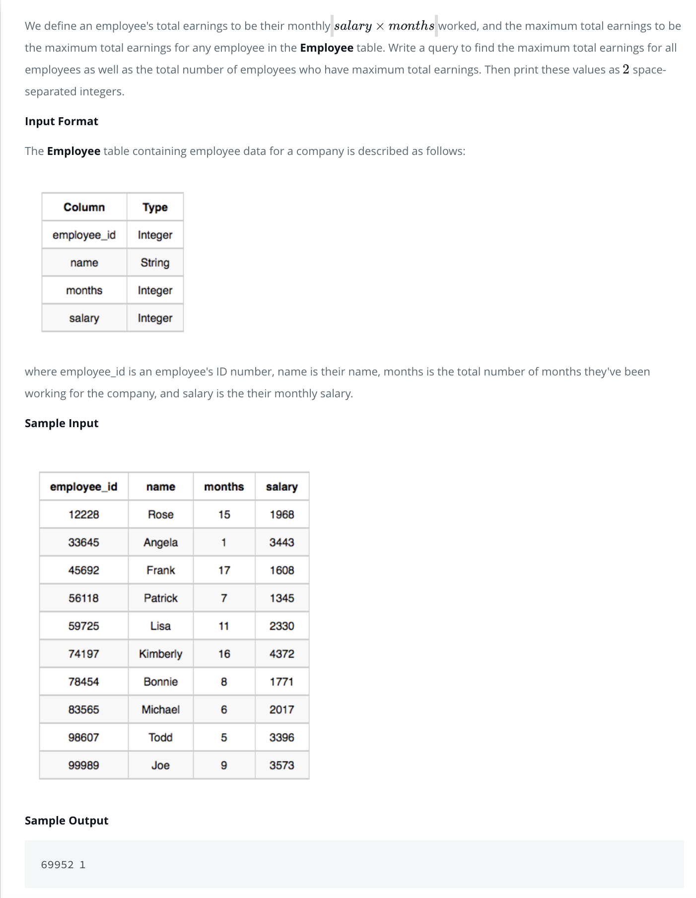
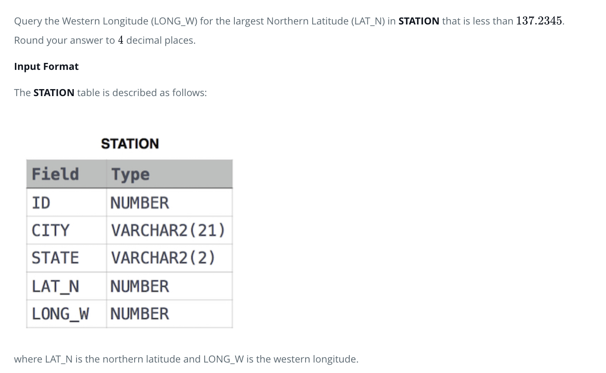
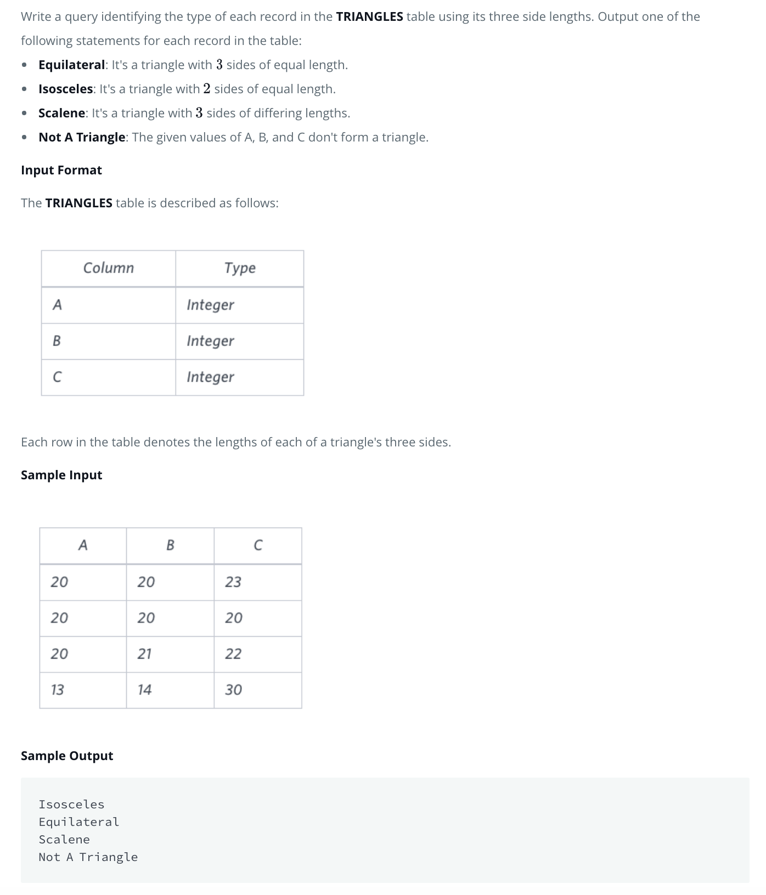
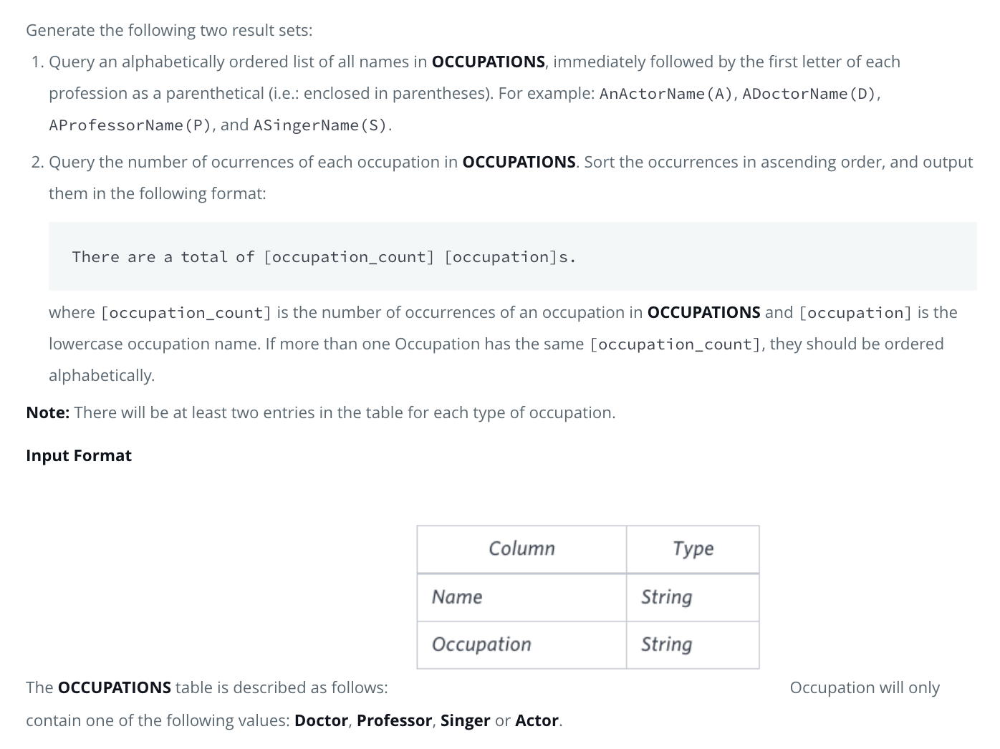
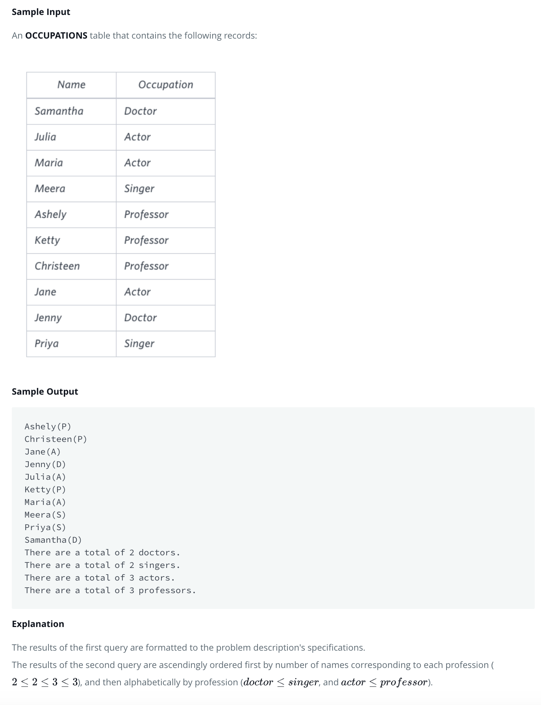
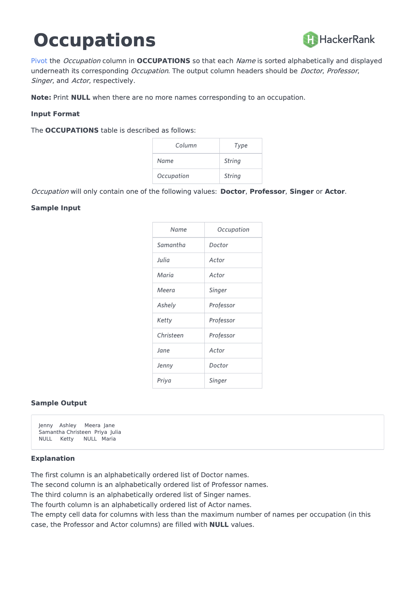
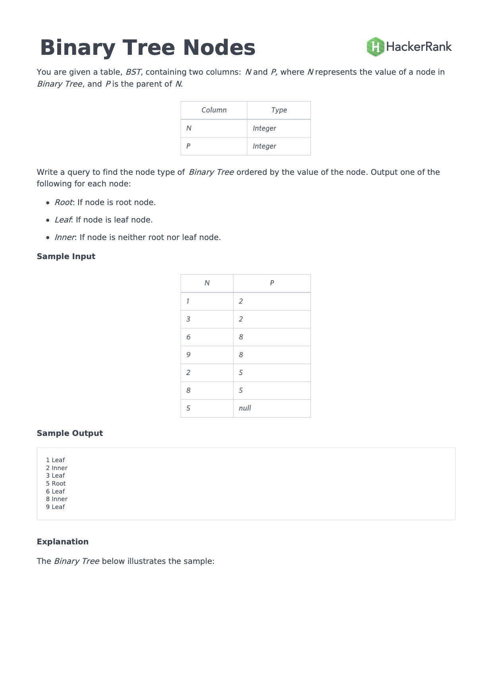

# 1-SQL-C1. To look for max and count of max



c

```SQL
  SELECT total_earnings, cnt
  FROM (
      SELECT salary * months AS total_earnings, COUNT(salary * months) AS cnt
      FROM Employee
      GROUP BY total_earnings
      ORDER BY total_earnings DESC
  ) AS Employee1
  LIMIT 1;
```

## Better Solution:

```SQL
select months*salary, count(*)
from Employee
group by 1
order by 1 desc
limit 1;
```

### GROUP BY 1

- to group by the first column regardless of what it's called.
- You can do the same with ORDER BY.

# 2-SQL-C2



## Solution SX:

```sql
SELECT ROUND(LONG_W, 4)
FROM STATION
WHERE LAT_N < 137.2345
ORDER BY LAT_N DESC
LIMIT 1;
```

## Another Solution:

```sql
SELECT ROUND(LONG_W,4)
FROM
STATION
WHERE LAT_N IN (SELECT MAX(LAT_N)
                FROM
                STATION
                WHERE LAT_N<137.2345)
```

Questions: 🍎
Can we use column in WHERE and Order by, and these column not in SELECT?

### Manhattan distance

- Definition: The distance between two points measured along axes at right angles. In a plane with p1 at (x1, y1) and p2 at (x2, y2), it is |x1 - x2| + |y1 - y2|.

### Euclidean Distance

- https://en.wikipedia.org/wiki/Euclidean_distance

SELECT CASE
WHEN MOD(COUNT(_), 2) != 0 THEN (
SELECT LAT_N
FROM STATION
ORDER BY LAT_N
LIMIT TRUNCATE(COUNT(_) / 2, 0), 1
)
ELSE
SELECT AVG(LAT_N)
FROM STATION
ORDER BY LAT_N
LIMIT COUNT(\*) / 2 - 1, 2
FROM STATION;

# 3-SQL-C3. NESTED CASE



## Solution SX:

```sql
SELECT CASE WHEN (A + B) > C AND (A + C) > B AND (B + C) > A
                THEN CASE WHEN A = B AND B = C THEN 'Equilateral'
                          WHEN A = B AND B != C THEN 'Isosceles'
                          WHEN A != B AND B = C THEN 'Isosceles'
                          WHEN A = C AND B != A THEN 'Isosceles'
                          ELSE 'Scalene'
                          END
                ELSE 'Not A Triangle'
                END
FROM TRIANGLES;
```

## Better Solution:

```sql
Select (case
        when not (a + b > c and b + c > a and c + a > b) then "Not A Triangle"
        when a = b and b = c then "Equilateral"
        when a = b or b = c or c = a then "Isosceles"
        else "Scalene"
        end)
from Triangles;
```

# 4-SQL-C4. String functions:

- CONCAT
- LEFT
- LOWER





## Solution SX:

```sql
SELECT CONCAT(Name, "(", LEFT(Occupation, 1), ")")
FROM OCCUPATIONS
ORDER BY Name;
SELECT CONCAT("There are a total of ", COUNT(*), " ", LOWER(Occupation), "s.")
FROM OCCUPATIONS
GROUP BY Occupation
ORDER BY COUNT(*);
```

# 5-SQL-C5. Pivot



```sql
SELECT doctor.name, professor.name, singer.name, actor.name
FROM (
    SELECT ROW_NUMBER() OVER (ORDER BY doctor.name) rownum,  doctor.name
    FROM (
        SELECT IF(Occupation='Doctor', Name, NULL) AS name
        FROM OCCUPATIONS ) AS doctor
    WHERE name IS NOT NULL
    ORDER BY doctor.name
) AS doctor
RIGHT JOIN (
    SELECT ROW_NUMBER() OVER (ORDER BY professor.name) rownum,  professor.name
    FROM (
        SELECT IF(Occupation='Professor', Name, NULL) AS name
        FROM OCCUPATIONS ) AS professor
    WHERE name IS NOT NULL
    ORDER BY professor.name
) AS professor
ON doctor.rownum = professor.rownum
LEFT JOIN (
    SELECT ROW_NUMBER() OVER (ORDER BY singer.name) rownum,  singer.name
    FROM (
        SELECT IF(Occupation='Singer', Name, NULL) AS name
        FROM OCCUPATIONS ) AS singer
    WHERE name IS NOT NULL
    ORDER BY singer.name
) AS singer
ON professor.rownum = singer.rownum
LEFT JOIN (
    SELECT ROW_NUMBER() OVER (ORDER BY actor.name) rownum,  actor.name
    FROM (
        SELECT IF(Occupation='Actor', Name, NULL) AS name
        FROM OCCUPATIONS ) AS actor
    WHERE name IS NOT NULL
    ORDER BY actor.name
) AS actor
ON singer.rownum = actor.rownum;
```

# 6-MySQL customized variable - add ROW Number

- SET variable is a independent sentence with ";"

```sql
SET @row_num = 0;

SELECT Name, @row_num := @row_num + 1 as rowNum
FROM Occupations
WHERE Occupation = "Doctor"
ORDER By Name;
```

# 7-MySQL ROW_NUMBER function

```sql
ROW_NUMBER() OVER (ORDER BY doctor.name)
```

# 8-MySQL JOIN ON and JOIN USING

- ON is the more general. One can join tables ON a column, a set of columns and even a condition.
- For example:

```sql
SELECT * FROM world.City JOIN world.Country ON (City.CountryCode = Country.Code) WHERE ...
```

- USING is useful when both tables share a column of the exact same name on which they join.
- In this case, one may say:

```sql
SELECT ... FROM film JOIN film_actor USING (film_id) WHERE ...
```

- Same query use ON vs USING

```sql
-- An additional nice treat is that one does not need to fully qualify the joining columns:
SELECT film.title, film_id -- film_id is not prefixed
FROM film
JOIN film_actor USING (film_id)
WHERE ...

-- To illustrate, to do the above with ON, we would have to write:
SELECT film.title, film.film_id -- film.film_id is required here
FROM film
JOIN film_actor ON (film.film_id = film_actor.film_id)
WHERE ...

```

# 9-MySQL PARTITION BY

- A PARTITION BY clause is used to partition rows of table into groups.
- It is useful when we have to perform a calculation on individual rows of a group using other rows of that group.
  - It is always used inside OVER() clause.
  - The partition formed by partition clause are also known as Window.
  - This clause works on windows functions only. Like- RANK(), LEAD(), LAG() etc.
  - If this clause is omitted in OVER() clause, then whole table is considered as a single partition.

## Syntax:

Window_function ( expression )
Over ( partition by expr [order_clause] [frame_clause] )

```sql
Select Occupation, NAme, Row_Number() OVer(Partition By Occupation ORder by NAme) SNo
From Occupations;
```

See output: https://www.hackerrank.com/challenges/occupations/problem?h_r=next-challenge&h_v=zen

# Binary Search Tree

https://www.hackerrank.com/challenges/binary-search-tree-1/problem?h_r=next-challenge&h_v=zen&h_r=next-challenge&h_v=zen


## Solution SX

### subquery as a variable

```sql
SELECT N AS Node, CASE WHEN P IS NULL THEN 'Root'
                WHEN (SELECT COUNT(*) FROM BST WHERE P = Node) = 0 THEN 'Leaf'
                ELSE 'Inner'
                END
FROM BST
ORDER BY Node;
```

# JOINS

https://www.hackerrank.com/challenges/the-company/problem?h_r=next-challenge&h_v=zen&h_r=next-challenge&h_v=zen&h_r=next-challenge&h_v=zen

```sql
SELECT
    C.company_code, founder,
    L.lead,
    S.senior,
    M.manager,
    E.employee
FROM Company AS C
JOIN (
    SELECT company_code, COUNT(DISTINCT lead_manager_code) AS lead
    FROM Lead_Manager
    GROUP BY company_code
) AS L
ON C.company_code = L.company_code
JOIN (
    SELECT company_code, COUNT(DISTINCT senior_manager_code) AS senior
    FROM Senior_Manager
    GROUP BY company_code
) AS S
ON  L.company_code = S.company_code
JOIN (
    SELECT company_code, COUNT(DISTINCT manager_code) AS manager
    FROM Manager
    GROUP BY company_code
) AS M
ON  S.company_code = M.company_code
JOIN (
    SELECT company_code, COUNT(DISTINCT employee_code) AS employee
    FROM Employee
    GROUP BY company_code
) AS E
ON  M.company_code = E.company_code
ORDER BY C.company_code;
```

# 10-Median

https://www.hackerrank.com/challenges/weather-observation-station-20/problem?utm_campaign=challenge-recommendation&utm_medium=email&utm_source=24-hour-campaign&h_r=next-challenge&h_v=zen&h_r=next-challenge&h_v=zen&h_r=next-challenge&h_v=zen

```sql
SET @row_number := -1;

SELECT ROUND(AVG(L.LAT_N), 4)
FROM (
    SELECT @row_number:=@row_number + 1 AS rowindex, STATION.LAT_N AS LAT_N
    FROM STATION
    ORDER BY LAT_N
) AS L
WHERE L.rowindex IN (FLOOR(@row_number / 2), CEIL(@row_number / 2));
```

- Solution:
  https://www.eversql.com/how-to-calculate-median-value-in-mysql-using-a-simple-sql-query/

# 11-MySQL Stored Procedure & WHILE LOOP

```SQL
-- set delimiter as "//"
delimiter //

CREATE PROCEDURE starprint(IN qty INT)
	BEGIN
		DECLARE cnt INT DEFAULT 1;

        WHILE cnt <= qty DO
			SELECT REPEAT('* ', cnt);
            SET cnt = cnt + 1;
		END WHILE;
	END//

-- set delimiter back to ";"
delimiter ;

DELIMITER $$

-- call the procedure
CALL starprint(5);
```

# 11-B MySQL Use CTE Recursive / Common Table Expression Recursive

```sql
WITH RECURSIVE cte AS
(
  SELECT 1 AS n, CAST('*' AS CHAR(500)) AS str
  UNION ALL
  SELECT n + 1, CONCAT(str, '*') FROM cte WHERE n < 5
)
SELECT str FROM cte;
```

# 12 MySQL Print Prime Number

- Write a query to print all prime numbers less than or equal to .
- Print your result on a single line,
- and use the ampersand (&) character as your separator (instead of a space).
- For example, the output for all prime numbers <= 10 would be:
- 2&3&5&7

## Solution Using Stored Function

```sql
DELIMITER $$
CREATE FUNCTION isprime( number INT)
RETURNS BOOl
DETERMINISTIC
BEGIN
	DECLARE i INT;
  DECLARE result BOOL;
  SET i = 2;
  SET result = TRUE;

  IF number <= 1 THEN
		SET result = FALSE;
	ELSE
		WHILE i < number AND result DO
			IF MOD(number, i) = 0 THEN
				SET result = FALSE;
			END IF;
			SET i = i + 1;
		END WHILE;
	END IF;
  RETURN result;
END$$
DELIMITER ;

DELIMITER $$
CREATE FUNCTION printprime( number INT)
RETURNS LONGTEXT
DETERMINISTIC
BEGIN
	DECLARE i INT;
    DECLARE result TEXT;
    SET i = 3;
    SET result = '2';
    IF number <= 1 THEN
		SET result = '';
	ELSEIF number = 2 THEN
		SET result = '2';
	ELSE
		WHILE i <= number DO
			IF isprime1(i) THEN
				SET result = CONCAT(result, '&', i);
			END IF;
			SET i = i + 1;
		END WHILE;
	END IF;

    RETURN result;
END$$
DELIMITER ;

SELECT printprime(1000);

```

## Solution Using Stored Procedure

```sql
DROP PROCEDURE IF EXISTS print_primes;

DELIMITER $$
CREATE PROCEDURE print_primes(number INT)

BEGIN
	DECLARE i INT DEFAULT 3;
  DECLARE j INT DEFAULT 2;
  DECLARE result TEXT DEFAULT '2';
  DECLARE is_prime BOOL DEFAULT TRUE;

  IF number <= 1 THEN
		SELECT '';
	ELSEIF number = 2 THEN
		SELECT 2;
	ELSE
		WHILE i <= number DO
			WHILE j < i AND is_prime DO
				IF MOD(i, j) = 0 THEN
					SET is_prime = FALSE;
				END IF;
				SET j = j + 1;
			END WHILE;

      IF is_prime THEN
				SET result = CONCAT(result, '&', i);
			END IF;

      SET j = 2;
      SET i = i + 1;
      SET is_prime = TRUE;
		END WHILE;

    SELECT result;
	END IF;
END$$

DELIMITER ;

CALL print_primes(1000);
```

# 13-MySQL recursive

```sql
WITH RECURSIVE cte (n) AS
(
  SELECT 1
  UNION ALL
  SELECT n + 1 FROM cte WHERE n < 8
)
SELECT * FROM cte;
```

# 13 Use CTE recursive to calculate Factorial

```sql
WITH RECURSIVE factorial(n, factorial) AS (
	SELECT 0, 1
    UNION ALL
    SELECT n + 1, factorial * (n + 1)
    FROM factorial
    WHERE n < 20 )
SELECT * FROM factorial;
```

# 14 Use CTE recursive to calculate Fibonacci Series - **Two-Level Sequence**

```sql
WITH RECURSIVE fibanacci (n, fib_n, next_fib_n) AS (
	SELECT 1, 0, 1
    UNION ALL
    SELECT n + 1, next_fib_n, fib_n + next_fib_n
    FROM fibanacci
    WHERE n < 20)
SELECT * FROM fibanacci;
```

# 15 Date Sequence

- https://www.percona.com/blog/2020/02/13/introduction-to-mysql-8-0-recursive-common-table-expression-part-2/

```sql
WITH RECURSIVE dates(date) AS (
	SELECT '2020-02-01'
    UNION ALL
    SELECT date + INTERVAL 1 day
    FROM dates
    WHERE date < '2020-02-08')
SELECT dates.date, COALESCE(SUM(price), 0) sales
FROM dates LEFT JOIN sales
ON dates.date = sales.order_date
GROUP BY dates.date;

```

# 15 MySQL Join using > and <, not =

```sql
SELECT CASE WHEN G.Grade >=8 THEN S.Name
            ELSE NULL
       END,
       G.Grade, S.Marks
FROM Students S
JOIN Grades G
ON S.Marks <= G.Max_Mark AND S.Marks >= G.Min_Mark
ORDER BY G.Grade DESC, S.Name, S.Marks;
```

### Join using BETWEEN

```sql
SELECT CASE WHEN G.Grade >=8 THEN S.Name
            ELSE NULL
       END,
       G.Grade, S.Marks
FROM Students S
JOIN Grades G
ON S.Marks BETWEEN G.Min_Mark AND G.Max_Mark
ORDER BY G.Grade DESC, S.Name, S.Marks;
```

# 16 ALL Operator and ANY Operator

- W3 Schoole https://www.w3schools.com/sql/sql_any_all.asp

## SQL zoo

- https://sqlzoo.net/wiki/SELECT_within_SELECT_Tutorial

- world table

| ame         | continent | area    | population | gdp          |
| ----------- | --------- | ------- | ---------- | ------------ |
| Afghanistan | Asia      | 652230  | 25500100   | 20343000000  |
| Albania     | Europe    | 28748   | 2831741    | 12960000000  |
| Algeria     | Africa    | 2381741 | 37100000   | 188681000000 |
| Andorra     | Europe    | 468     | 78115      | 3712000000   |
| Angola      | Africa    | 1246700 | 20609294   | 100990000000 |

...

## find the largest country in the world, by population with this query:

-
- You need the condition population>0 in the sub-query as some countries have null for population.

```sql
SELECT name
  FROM world
 WHERE population >= ALL(SELECT population
                           FROM world
                          WHERE population>0)
```

## Which countries have a GDP greater than every country in Europe? [Give the name only.] (Some countries may have NULL gdp values)

```sql
SELECT name
FROM world
WHERE gdp > ALL(SELECT gdp
               FROM world
               WHERE gdp>0 AND continent IN ('Europe'));

```

## Largest in each continent

### Find the largest country (by population) in each continent, show the continent, the name and the population:

```sql
SELECT continent, name, population
FROM world x
WHERE population >= ALL
    (SELECT population FROM world y
     WHERE y.continent=x.continent
     AND population>0)
```

### Find the largest country (by area) in each continent, show the continent, the name and the area:

```sql
SELECT continent, name, area
FROM world x
WHERE area >= ALL
    (SELECT area FROM world y
     WHERE y.continent=x.continent
     AND area>0)
```

## First country of each continent (alphabetically)

### List each continent and the name of the country that comes first alphabetically.

```sql
SELECT continent, name
FROM world X
WHERE name IN (SELECT TOP 1 name
               FROM world Y
               WHERE Y.continent = X.continent
               ORDER BY name)
```

## Find the continents where all countries have a population <= 25000000. Then find the names of the countries associated with these continents. Show name, continent and population.

```sql
SELECT name, continent, population
FROM world
WHERE continent IN (
   SELECT DISTINCT continent
   FROM world X
   WHERE 25000000 > ALL (
       SELECT population
       FROM world Y
       WHERE Y.continent = X.continent
    )
);
```

## Some countries have populations more than three times that of any of their neighbours (in the same continent). Give the countries and continents.

```sql
SELECT name, continent
FROM world X
WHERE population/3 > ALL(
    SELECT population
    FROM world Y
    WHERE Y.continent = X.continent
    AND Y.name <> X.name
)
```

## show the countries with a greater GDP than any country in Africa (some countries may have NULL gdp values).

```sql
SELECT name FROM bbc
 WHERE gdp > (SELECT MAX(gdp) FROM bbc WHERE region = 'Africa')
```

# 17 JOIN

## SQLZOO JOIN 13 https://sqlzoo.net/wiki/The_JOIN_operation

```sql
SELECT mdate,
       team1,
       (SELECT COUNT(teamid) FROM goal WHERE goal.matchid = game.id AND goal.teamid = game.team1) AS score1,
       team2,
       (SELECT COUNT(teamid) FROM goal WHERE goal.matchid = game.id AND goal.teamid = game.team2) AS score2
FROM game
```
