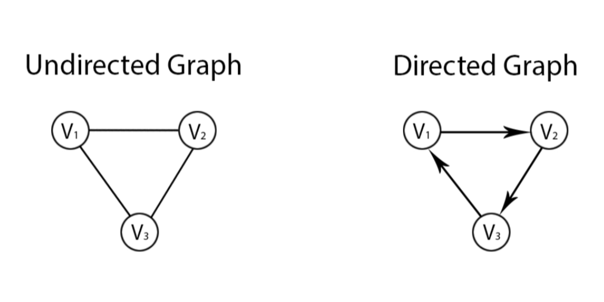

# subString vs subSequence

- subString: 连续字符, O(n^2)
  - 字符串的子串必须是连续的，如"abcd"的子串有"ab","bcd"等，但是"ac"不是"abcd"的子串。因此，对于长度为 n 的字符串，共有 1+2+...+n 个非空子串，即(n+1)\*n/2 个，是 O(n^2)级别的。
- subSequence: 非连续字符， O(2^n)
  - 字符串的子序列不需要是连续的，因此对于长度为 n 的字符串的子序列，每个字符都有选或不选两种可能。 因此其子序列的数量是指数级别 O(2^n)的

# Global variable

- 全局变量在工程中会出现很大的问题，如果在面试中使用了全局变量，会让人看起来没有什么代码经验

# Python \*

```python
a = [[0] * 2] * 2
a[0][0] = 1
print(a)
# output: [[1, 0], [1, 0]]
# a[0]和a[1]其实是同一个数组的两个分身，它们所对应的数组是相同，因此修改a[0]中的元素，同样会修改a[1]。但是a[0][0]和a[0][1]不是数组（对象），只是数字（基础数据类型，如字符，布尔值等），因此不会同时改变。
```

# Good Quality Code:

- Bug Free
- Good Coding Style:
  - 变量名命名规范有意义
  - 合理使用空格
  - 善于使用空行
- 容易让人读懂的逻辑。
  - **要把复杂的事情用简单的方式**
  - 别把简单的事情写复杂了
- 没有冗余代码
- 有边界检测和异常处理

# Coding Quality

- Coding Style 相关:

  - 二元运算符两边加空格，单元运算符不加空格

    - 二元运算符:
      - - - /
    - 单元运算符:
      - i++ i-- !

  - 花括号和 for, if 之间要加空格(Java)，圆括号和 if 之间要加空格
  - 用空行分隔开不同的逻辑块
  - 逗号, 分号 后面加空格

- Readability 相关

  - 函数名和变量名用 1-2 个单词作为名称
  - 确保一个函数内部不超过 3 层缩进（indention），
    - 如果需要超过了 3 层就用子函数
    - 缩进越多，出错概率越高
  - 多用子函数来减少入口函数的代码量
  - **多用 continue 少用 if**

    ```

      # Try avoid the following style
      for .....
        if condition:
          do something
          do something
          do something
      # Instead use the following style
      # This style would reduce one layer indentation
      for .....
        if not condition:
          continue
        do something
        do something
        do something
    ```

  - 少用 else

    ```

    if condition:
      do something
    else:
      do somethings


    if condition
      return
    return
    ```

  - no if else 嵌套， 尽量不要嵌套，用平行 if

    ```

    # avoid using if else inside another if else
    if A:
      if B:
        do sth 1
      else:
        do sth 2
    else:
      if B:
        do sth 3
      else:
        do sth 4
    # Try to use parallel if
    if A & B:
      do sth 1
    elif A & not B:
      do sth 2
    elif not A & B:
      do sth 3
    elif not A & not B:
      do sth 4

    ```

- Bug Free 相关
  • 不管有没有可能出问题，都要对入口函数的参数进行异常检测
  • 访问一个下标的时候，一定要确保这个下标不会越界
  • 访问一个对象的属性或者方法时，一定要确保这个对象不是空
  • 不用全局变量

- 通过函数化，避免全局变量等手段

- 付无穷大

  ```

    -float('inf')
  ```

- Enumeration: 枚举法

  - 打擂台算法

- O(N) 时间复杂度的算法：

  - 双指针算法
  - 打擂台算法
  - 单调队列算法
  - 单调栈算法

- 双指针算法

  - 相向双指针 （判断回文串）多
    - Reverse 型
      - 翻转字符串
      - 判断回文串
    - Two Sum
      - 两数只和
      - 三数之和
    - Partition
      - 快速 sort
      - 颜色 sort
  - 背向双指针 （最长回文串）少

  - 同向双指针 多

- Valid Palindrome

  - 判断一个字符串忽略大小写和非法字符之后是否是一个回文串

  ```

    class Solution:
      """
      @params: A string
      @return: Whether the string is a valid lsakdjf

  ```

- 快速排序在大部分时候的时间复杂度都是 O(nlogn)，但是当数组为逆序排序时（假设每次以第一个元素为 pivot），时间复杂度将会退化到 O(n^2)

复杂度 可能对应的语法 备注
O(1) 位运算 常数级复杂度，一般面试中不会有
O(logn) 二分法，倍增法，快速幂算法，辗转相除法
O(n) 枚举法，双指针算法，单调栈算法，KMP 算法，Rabin Karp，Manacher's Algorithm 又称作线性时间复杂度
O(nlogn) 快速排序，归并排序，堆排序
O(n^2) 枚举法，动态规划，Dijkstra
O(n^3) 枚举法，动态规划，Floyd
O(2^n) 与组合有关的搜索问题
O(n!) 与排列有关的搜索问题

例如，给定一个已经排序的数组，现在有多次询问，每次询问一个数字是否在这个数组中，返回 True or False.

方法 1： 每次扫描一遍数组，查看是否存在。
这个方法，每次查询的时间复杂度是: O(n)。

方法 2：由于已经有序，可以使用二分查找的方法。
这个方法，每次查询的时间复杂度是: O(logn)。

方法 3：将数组中的数存入 Hashset。
这个方法，每次查询的时间复杂度是: O(1)。

## 内存中的栈空间与堆空间

我们通常所说的内存空间，包含了两个部分：栈空间（Stack space）和堆空间（Heap space）

当一个程序在执行的时候，操作系统为了让进程可以使用一些固定的不被其他进程侵占的空间用于进行函数调用，递归等操作，会开辟一个固定大小的空间（比如 8M）给一个进程使用。这个空间不会太大，否则内存的利用率就很低。这个空间就是我们说的栈空间，Stack space。

我们通常所说的栈溢出（Stack Overflow）是指在函数调用，或者递归调用的时候，开辟了过多的内存，超过了操作系统余留的那个很小的固定空间导致的。那么哪些部分的空间会被纳入栈空间呢？栈空间主要包含如下几个部分：

函数的参数与返回值
函数的局部变量

```

  def f(n):
    nums = [0]*n  # 相当于Java中的new int[n]
    sum = 0
    for i in range(n):
        nums[i] = i
        sum += i
    return sum
```

根据我们的定义，参数 n，最后的函数返回值 f，局部变量 sum 都很容易的可以确认是放在栈空间里的。那么主要的难点在 nums。

这里 nums 可以理解为两个部分：

一个名字叫做 nums 的局部变量，他存储了指向内存空间的一个地址（Reference），这个地址也就是 4 个字节（32 位地址总线的计算机，地址大小为 4 字节）
new 出来的，一共有 n 个位置的整数数组，int[n]。一共有 4 \* n 个字节。
这里 nums 这个变量本身，是存储在栈空间的，因为他是一个局部变量。但是 nums 里存储的 n 个整数，是存储在堆空间里的，Heap space。他并不占用栈空间，并不会导致栈溢出。

在大多数的编程语言中，特别是 Java, Python 这样的语言中，万物皆对象，基本上每个变量都包含了变量自己和变量所指向的内存空间两个部分的逻辑含义。

```

  def copy(nums):
    arr = [0]*len(nums)  # 相当于Java中的new int[nums.length]
		for i in range(len(nums)):
        arr[i] = nums[i]
    return arr

  # 用list comprehension实现同样功能
  def copy(nums):
      arr = [x for x in nums]
      return arr

  # 以下相当于Java中的main函数
  if __name__ == "__main__":
      nums = [0]*10
      nums[0] = 1
      new_nums = copy(nums)
```

在 copy 这个函数中，arr 是一个局部变量，他在 copy 函数执行结束之后就会被销毁。但是里面 new 出来的新数组并不会被销毁。
这样，在 main 函数里，new_nums 里才会有被复制后的数组。所以可以发现一个特点：

栈空间里存储的内容，会在函数执行结束的时候被撤回

简而言之可以这么区别栈空间和堆空间：

new 出来的就放在堆空间，其他都是栈空间

## 什么是递归深度

递归深度就是递归函数在内存中，同时存在的最大次数。

```py
  def factorial(n):
    if n == 1:
        return 1
    return factorial(n-1) * n

```

当 n=100 时，递归深度就是 100。一般来说，我们更关心递归深度的数量级，在该阶乘函数中递归深度是 O(n)，而在二分查找中，递归深度是 O(log(n))。在后面的教程中，我们还会学到基于递归的快速排序、归并排序、以及平衡二叉树的遍历，这些的递归深度都是(O(log(n))。注意，此处说的是递归深度，而并非时间复杂度。

## 太深的递归会内存溢出

首先，函数本身也是在内存中占空间的，主要用于存储传递的参数，以及调用代码的返回地址。

函数的调用，会在内存的栈空间中开辟新空间，来存放子函数。递归函数更是会不断占用栈空间，例如该阶乘函数，展开到最后 n=1 时，内存中会存在 factorial(100), factorial(99), factorial(98) ... factorial(1)这些函数，它们从栈底向栈顶方向不断扩展。

当递归过深时，栈空间会被耗尽，这时就无法开辟新的函数，会报出 stack overflow 这样的错误。
所以，在考虑空间复杂度时，递归函数的深度也是要考虑进去的。

Follow up：
尾递归：若递归函数中，递归调用是整个函数体中最后的语句，且它的返回值不属于表达式的一部分时，这个递归调用就是尾递归。（上例 factorial 函数满足前者，但不满足后者，故不是尾递归函数）
尾递归函数的特点是：在递归展开后该函数不再做任何操作，这意味着该函数可以不等子函数执行完，自己直接销毁，这样就不再占用内存。一个递归深度 O(n)的尾递归函数，可以做到只占用 O(1)空间。这极大的优化了栈空间的利用。
但要注意，这种内存优化是由编译器决定是否要采取的，不过大多数现代的编译器会利用这种特点自动生成优化的代码。在实际工作当中，尽量写尾递归函数，是很好的习惯。
而在算法题当中，计算空间复杂度时，建议还是老老实实地算空间复杂度了，尾递归这种优化提一下也是可以，但别太在意。

## 一个不会出现死循环的通用二分法模板

```java
  public class Solution {
    /**
     * @param A an integer array sorted in ascending order
     * @param target an integer
     * @return an integer
     */
    public int findPosition(int[] nums, int target) {
        if (nums == null || nums.length == 0) {
            return -1;
        }

        int start = 0, end = nums.length - 1;
        // 要点1: start + 1 < end
        while (start + 1 < end) {
     // 要点2：start + (end - start) / 2
            int mid = start + (end - start) / 2;
            // 要点3：=, <, > 分开讨论，mid 不+1也不-1
            if (nums[mid] == target) {
                return mid;
            } else if (nums[mid] < target) {
                start = mid;
            } else {
                end = mid;
            }
        }

        // 要点4: 循环结束后，单独处理start和end
        if (nums[start] == target) {
            return start;
        }
        if (nums[end] == target) {
            return end;
        }
        return -1;
    }
  }
```

```py
  class Solution:
    # @param nums: The integer array
    # @param target: Target number to find
    # @return the first position of target in nums, position start from 0
    def binarySearch(self, nums, target):
        if not nums:
            return -1

        start, end = 0, len(nums) - 1
        # 用 start + 1 < end 而不是 start < end 的目的是为了避免死循环
        # 在 first position of target 的情况下不会出现死循环
        # 但是在 last position of target 的情况下会出现死循环
        # 样例：nums=[1，1] target = 1
        # 为了统一模板，我们就都采用 start + 1 < end，就保证不会出现死循环
        while start + 1 < end:
            # python 没有 overflow 的问题，直接 // 2 就可以了
            # java和C++ 最好写成 mid = start + (end - start) / 2
            # 防止在 start = 2^31 - 1, end = 2^31 - 1 的情况下出现加法 overflow
            mid = (start + end) // 2

            # > , =, < 的逻辑先分开写，然后在看看 = 的情况是否能合并到其他分支里
            if nums[mid] < target:
                start = mid
            elif nums[mid] == target:
                end = mid
            else:
                end = mid

        # 因为上面的循环退出条件是 start + 1 < end
        # 因此这里循环结束的时候，start 和 end 的关系是相邻关系（1和2，3和4这种）
        # 因此需要再单独判断 start 和 end 这两个数谁是我们要的答案
        # 如果是找 first position of target 就先看 start，否则就先看 end
        if nums[start] == target:
            return start
        if nums[end] == target:
            return end

        return -1

```

如果你之前写过二分的题目，你会发现在二分问题中，最常见的错误就是死循环。而这个模版一定不会出现死循环。为什么呢？
因为我们这边使用了 start + 1 < end, 而不是 start < end 或者 start <= end
二分法的模板中，整个程序架构分为两个部分：
通过 while 循环，将区间范围从 n 缩小到 2 （只有 start 和 end 两个点）。
在 start 和 end 中判断是否有解。
而普通的 start < end 或者 start <= end 在寻找目标最后一次出现的位置的时候，可能出现死循环。

有同学可能会问为什么明明可以 start = mid + 1 偏偏要写成 start = mid?
大部分时候，mid 是可以 +1 和 -1 的。在一些特殊情况下，比如寻找目标的最后一次出现的位置时，当 target 与 nums[mid] 相等的时候，是不能够使用 mid + 1 或者 mid - 1 的。因为会导致漏掉解。那么为了节省脑力，统一写成 start = mid / end = mid 并不会造成任何解的丢失，并且也不会损失效率——log(n) 和 log(n+1) 没有区别。

# 什么是队列（Queue）？
- 队列（queue）是一种采用先进先出（FIFO，first in first out）策略的抽象数据结构
- 比如生活中排队，总是按照先来的先服务，后来的后服务。
- 最常用的就是在宽度优先搜索(BFS）中，记录待扩展的节点。
- 队列这个数据结构是宽度优先搜索算法的基础数据结构，宽度优先搜索就是基于队列实现的。

## 队列内部存储元素的方式，一般有两种，数组（array）和链表（linked list）。两者的最主要区别是：
- 数组对随机访问有较好性能。
- 链表对插入和删除元素有较好性能。


## 用数组实现队列
- 在使用数组表示队列时，我们首先要创建一个长度为MAXSIZE的数组作为队列。
- 因为MAXSIZE是数组的长度，那MAXSIZE-1就是队列的最大下标了。
- 在队列中，除了用一组地址连续的存储单元依次存储从队首到队尾的元素外，还需要附设两个整型变量head和tail分别指示队首和队尾的位置。
- 我们主要介绍三个操作：
  - 初始化队列
  - enqueue()向队尾插入元素
  - dequeue()删除并返回队首元素
- 每次元素入队时，tail向后移动；每次元素出队时，head向后移动。
- 我们可以将队列视作一个类，通过成员变量数组来表示一组地址连续的存储单元，再定义两个成员变量head和tail，将队列的基本操作定义成类的方法。
  - 为了将重点放在实现队列上，做了适当简化。示范队列仅支持整数类型，若想实现泛型，可用反射机制和object对象传参；
  - 此外，可多做安全检查并抛出异常
```python
class MyQueue(object):
    def __init__(self):
        # do some intialization if necessary
        self.MAXSIZE = 4
        self.queue = [0] * self.MAXSIZE
        self.head, self.tail = 0, 0
    
    """
    
    """

    def enqueue(self, item):
      """
      Add a new element into queue
      @param: item: An integer
      @return: nothing
      """
      queue = self.queue
        
      # 队列满
      if self.tail == self.MAXSIZE:
        return
      
      queue[self.tail] = item
      self.tail += 1
        

    def dequeue(self):
      """
      Remove an element from queue return it
      @return: An integer
      """
      queue = self.queue
      
      # 队列为空
      if self.head == self.tail:
        return -1
      
      item = queue[self.head]
      self.head += 1
      return item
```

- 但是大家会发现，如果这样实现队列的话，我们考虑MAXSIZE为4的情况，如果我们采取下面的操作
```python
  enqueue(1)
  enqueue(2)
  enqueue(3)
  enqueue(3)     
  dequeue()
  dequeue() 
```
- 结束后数组的状态时[^, ^, 3, 4], head = 2, tail = 4。（'^'表示该位置为空，即当前元素已经出队
- 从我们之前的判断来看，tail == MAXSIZE , 当前队列已经满了，不能继续添加元素了，
- 但是实际上我们还可以继续添加元素。因此在使用数组实现队列时，可能会出现空间未有效利用的情况，因此，我们有两种解决方法：
  1. 使用链表来实现队列
  2. 使用数组来实现循环队列
 
## 用链表实现队列
- 链表是由多个节点构成的，
- 一个节点由两部分组成:一个是数据域,一个是指针域.
- 链表分为:
  - 单链表(只能是父节点引用子节点),
  - 双链表(相邻的节点可相互引用),
  - 循环链表(在双链表的基础上,头尾节点可相互引用).
- 实现链表,就是在链表里加入节点,使用节点的引用域使节点之间形成连接,可相互调用.
- 链表队列的实现原理:首先定义一个节点类,节点类包含引用域和数据域.
- 然后定义一个链表类,链表类形成节点间的引用关系.

- 我们主要介绍三个操作：
  - 初始化队列
  - enqueue()向队尾插入元素
  - 初始化队dequeue()删除并返回队首元素列
- 在队列中，我们只要用两个指针head和tail分别指向链表的头部和尾部即可实现基本队列功能
```python
class Node():
  def __init__(self, _val):
    self.next = None
    self.val = _val
  
  def enqueue(self, item):
    """
    Add a new element into queue
    @param: item: An integer    
    @return: nothing
    """                                
    if self.head is None:
        self.head = Node(item)
        self.tail = self.head
    else:
        self.tail.next = Node(item)
        self.tail = self.tail.next


    def dequeue(self):
        if self.head is not None:
            item = self.head.val
            self.head = self.head.next
            return item
        return -1
```
### 可以发现链表可以轻松地避免“假溢出”的问题，因为在每次需要新增元素时，只需要新建一个ListNode就可以了。

##  如何用数组实现循环队列
- 队列是一种先进先出的线性表，它只允许在表的一端进行插入，而在另一端删除元素。
- 允许插入的一端称为队尾，允许删除的一端称为队首
#### 假溢出
- 数组实现的队列会导致“虽然数组没满，但是tail已经指向了数组末尾，返回数组已满，队列溢出的错误信号”   
#### 克服"假溢出"现象的方法是：将向量空间想象为一个首尾相接的圆环，并称这种向量为循环向量
- 存储在其中的队列称为循环队列（Circular Queue）
- 循环队列是把顺序队列首尾相连，把存储队列元素的表从逻辑上看成一个环，成为循环队列。
- 在循环队列中，除了用一组地址连续的存储单元依次存储从队首到队尾的元素外，
- 还需要附设两个整型变量head和tail分别指示队首和队尾的位置。
- 我们可以将循环队列视作一个类，
  - 通过成员变量数组来表示一组地址连续的存储单元，
  - 再定义两个成员变量head和tail，
  - 将循环队列的基本操作定义成类的方法，
- 循环效果则用“模”运算实现，以此来实现循环队列
  - 每当tail到达末尾的时候，将tail对MAXSIZE取模，使其回到队首。
#### 但是如果这样我们会发现一个问题，队列为空和队列已满的条件都成了tail == head。
#### 为了避免这种无法判断的情况，我们规定当循环队列只剩一个空位的时候，就认为队列已满。
#### 这样队列已满的条件就成了 (tail + 1) % MAXSIZE == head。
```python
class MyQueue(object):
  
  def __init__(self):
    self.SIZE = 100000
    self.queue = [0] * self.SIZE
    self.head = 0
    self.tail = 0
    
  def enqueue(self, item):
    # Queue is full
    if (self.tail + 1) % self.SIZE == self.head:
      return
    
    self.queue[self.tail] = item
    self.tail = (self.tail + 1) % self.SIZE
    
     ai
  def dequeue(self):
    # Queue is empty
    if self.tail == self.head:
      return -1
    item = self.queue[self.head]
    self.head = (self.head + 1) % self.SIZE
    return item
```

# BFS 宽度优先搜索
## BFS 适用场景
- 分层遍历
  - 一层一层的遍历一个图，树，矩阵
  - 简单图最短路径
    - 简单图的定义是：图中所有边长都一样
- 连痛块问题
  - 通过图中一个点找到其他所有联通的点
  - 找到所有方案问题的一种非递归实现方式
- 拓扑排序
  - 实现容易度远超过DFS
  
### 先序遍历通常使用递归方式来实现，即使使用非递归方式，也是借助栈来实现的，所以并不适合BFS，
### 而层次遍历因为是一层一层的遍历，所以是BFS十分擅长的；
### 边长一致的图是简单图，所以可以用BFS，因为BFS只适用于简单图
### 矩阵连通块也是BFS可以处理的问题，求出最大块只需要维护一个最大值即可；
### 求所有方案问题，因此可以用BFS来处理，但是并不是唯一的解决方式。

# 什么是图（Graph）？
- 图在离线数据中的表示方法为 <E, V>，E表示 Edge，V 表示 Vertex。
- 也就是说，图是顶点（Vertex）和边（Edge）的集合。
- 图分为：
  - 有向图（Directed Graph）
  - 无向图（Undirected Graph）
- BFS 大部分的时候是在图上进行的。
- BFS 在两种图上都适用。另外，树（Tree）也是一种特殊的图。
- 


## 二叉树的BFS vs 图的BFS：
- 二叉树中进行 BFS 和图中进行 BFS 最大的区别就是二叉树中无需使用 HashSet（C++: unordered_map, Python: dict) 来存储访问过的节点（丢进过 queue 里的节点）
- 因为二叉树这种数据结构，上下层关系分明，没有环（circle），所以不可能出现一个节点的儿子的儿子是自己的情况。
- 但是在图中，一个节点的邻居的邻居就可能是自己了。

- 我们假设一张图有4个顶点，其中1与2有一条边，2与3有一条边，3与1有一条边，即使节点4没有边，这4个点也构成图，只是图不连通而已；
- 图上的节点如果有一条边连接自己，那么就形成了自环，自环在图中是可以存在的。
                
## 图的数据结构
- 有很多种方法可以存储一个图，最常用的莫过于：
  1. 邻接矩阵
  2. 邻接表
- 而邻接矩阵因为耗费空间过大，我们通常在工程中都是使用邻接表作为图的存储结构。

### 邻接矩阵 Adjacency Matrix
[
  [1,0,0,1],
  [0,1,1,0],
  [0,1,1,0],
  [1,0,0,1]
]
- 例如上图表示0号点和3号点有连边。1号点和2号点有连边。
- 当然，每个点和自己也是默认有连边的。
- 图中的 0 表示不连通，1 表示连通。
- 我们也可以用一个更具体的整数值来表示连边的长度。
- 邻接矩阵我们可以直接用一个二维数组表示，如
  - int[][] matrix;
- 这种数据结构因为耗费 O(n^2) 的空间，所以在稀疏图上浪费很大，因此并不常用。

### 邻接表 (Adjacency List)
[
  [1],
  [0,2,3],
  [1],
  [1]
]
- 这个图表示 0 和 1 之间有连边，1 和 2 之间有连边，1 和 3 之间有连边。
- 即每个点上存储自己有哪些邻居（有哪些连通的点）。
- 这种方式下，空间耗费和边数成正比，
  - 可以记做 O(m)，m代表边数。m最坏情况下虽然也是 O(n^2)
  - 但是邻接表的存储方式大部分情况下会比邻接矩阵更省空间。
  
- 可以用自定义的类来实现邻接表edGraphNode {rs;
```python
# Python:                                            
def DirectedGraphNode:                             
  def init(self, label):                             
    self.label = label                                 
    self.neighbors = [] # a list of DirectedGraphNode's
```


也可以使用 HashMap 和 HashSet 搭配的方式来存储邻接表
Map<T, Set> = new HashMap<Integer, HashSet>();
Python:

假设nodes为节点标签的列表:
使用了Python中的dictionary comprehension语法
adjacency_list = {x:set() for x in nodes}

另一种写法
adjacency_list = {}
for x in nodes:
adjacency_list[x] = set()
其中 T 代表节点类型。通常可能是整数(Integer)。
这种方式虽然没有上面的方式更加直观和容易理解，但是在面试中比较节约代码量。
而自定义的方法，更加工程化，所以在面试中如果时间不紧张题目不难的情况下，推荐使用自定义邻接表的方式。

### 为什么 BFS 可以搜索到最短路？
- 因为BFS是按照层级进行搜索，所以搜到答案时，一定是最短的一条路径。
  - 我们可以使用反证法进行证明：
  - 我们假设当前搜索到的路径 Y 不是最短的，那就说明存在一条更短的路径 X（即 X < Y）。
  - 令路径 X 中的所有点是 {x1,x2,...,xx}。
  - 那么x1是起点，且为 BFS 的第一层，x2为第二层......xx为第x层，
  - 此时的结果与BFS中第Y层初次遇到xx点产生矛盾。
  - 因此不存在任何一条比Y短的路径能找到终点。
  
# 递归 Recursion，深度优先搜索 DFS， 和回溯法 Backtracking 的区别
## 递归 Recursion
- 递归函数：程序的一种实现方式， 即函数进行了自我调用
- 递归算法： 即大问题的结果依赖于小问题的结果， 于是先用递归函数求解小问题
- 般我们说递归的时候， 大部分时候堵在说递归函数而不是递归算法
## 深度优先搜索  DFS
- 可以用递归函数来实现
- 也可以不用递归函数来实现， 如自己通过一个手动创建的栈 Stack 进行操作
- 深度优先搜索通常是指在搜索的过程中优先搜索深度更深的点而不是按照宽度搜索同层节点。
## 回溯 Backtracking
- 回溯 Backtracking  =  深度优先搜索  DFS  
- 回溯法就是深度优先搜索算法
- 回溯操作： 
  - 递归函数再回到上一层递归调用处的时候，一些参数需要改回到调用前的值， 这个操作就是回溯， 即让状态参数回到之前的值。
  - 递归调用之前做了什么改动， 递归调用之后都改回来

