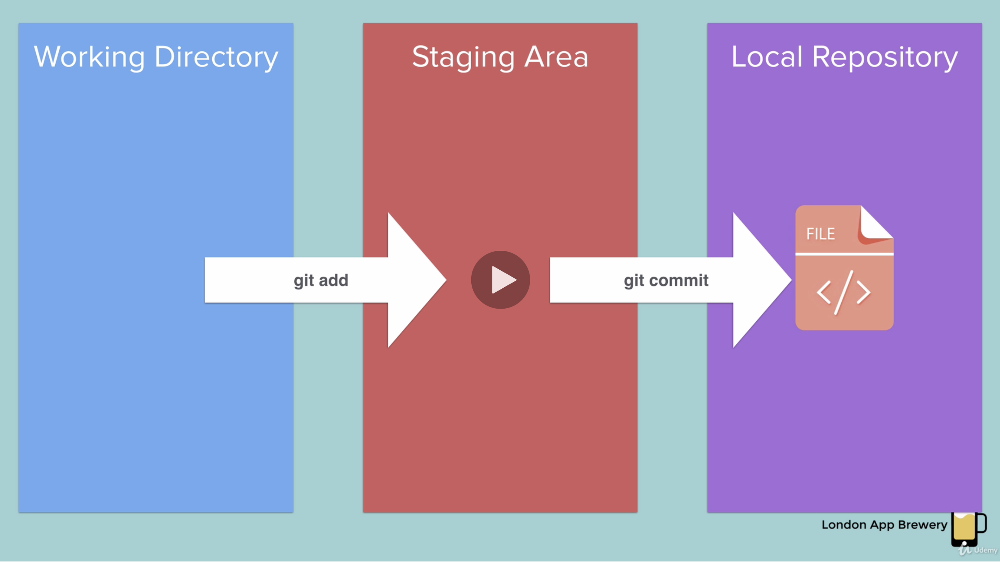
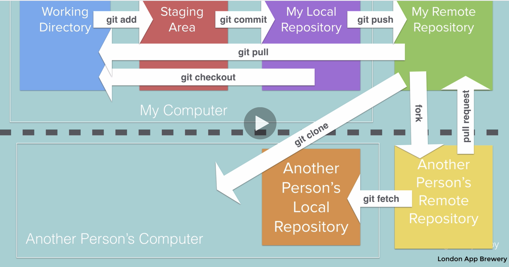

- What is Git / GitHub

  - Git and GitHub are tools that help people collaborate and safely store their code.
  - GitHub is an online space to store code.
  - GitHub also allows you to share code with other people and work together on projects.
  - Git

    - a software application that runs on your machine
    - allows you to add things to GitHub
    - and to download things from GitHub.

    - Git is a version control software that runs on your computer.

    - Git tracks tracks changes to any files in your project.

      - If you have a working application and you accidentally break it, you can roll it back to a previous point.
      - ou can go back to any point in time that you saved.

    - It allows you to add (push) and download (pull) code from your online code repository on GitHub.
      - This functionality is similar to the Dropbox client that syncs your local files with Dropbox.
    - If you used git and saved (pushed) frequently enough, you can roll back to exactly the point where you took a wrong turn.

- What is GitHub?

  - GitHub is a web-based storage solution for developers.
  - It's like the developer's Dropbox or Google Drive.
  - It's also a version control system.
  - Cloud storage, version control, and source code management all in one!
  - GitHub is an online space to work collaboratively on projects and keep your code safe.

- Git tracks your changes to the source code via commits, and syncs with a remote source, like GitHub
- via push (to send your commits to the remote)
- pull (to retrieve commits from the remote) commands.

- How do I use Git and GitHub?

  - Create a new repository
  - Copy the link
  - In terminal, cd into the directory where you want your repo to live
  - Clone the repo using git clone <repo name>
  - cd into the repo
  - Add a file
  - Stage the changes in your current working directory using git add .
  - Commit the changes using git commit -m "some message"
  - Push the changes using git push origin main

- Feature Branching

  - The main idea behind feature branching is that all feature development should take place in a dedicated branch rather than pushing directly to the main branch.
  - How to work

    - Create a new branch.
    - Then, all changes to our repository (additions, modifications, or deletion) are made inside this branch.
    - We then commit our changes, and push them to the remote source (GitHub).
    - Once the branch has been pushed to the remote, we open a Pull Request.
    - Once the Pull Request has been made, there will very often be automated tests that run to ensure that your modifications to not break the working application.
    - Pull Requests also initiate a discussion about the changes you've committed, and generally have to be approved by someone else on the team. That person (or entire team) will review your changes to make sure that everything is in order.
    - Once any concerns have been addressed and the Pull Request has been approved, the modified code is merged into the main branch.

  - Steps

    - cd into the repo directory
    - Create and switch to a new branch using git checkout -b new-branch-name
    - Make the changes to your repository that you desire
    - Stage the changes using git add -A
    - Commit the changes using git commit -m "some message"
    - Push the changes using git push origin new-branch-name
    - Navigate to your GitHub repository in your browser
    - On the Pull requests tab, create a new pull request

  - To switch between existing branches

    - git checkout branch-name
    - Note that you do not need the -b flag in your git checkout command this time because we are not creating a new branch.

  - To merge your changes into main, and update your local repository with those changes:
    - On GitHub, merge the Pull Request you created.
    - On your computer, switch back to your main branch using git checkout main
    - Pull the updates from the remote server with git pull

- Terminology

  - Version Control System (VCS) or Source Code Manager (SCM)
    - A VCS allows you to:
      - revert files back to a previous state
      - revert the entire project back to a previous state,
      - review changes made over time,
      - see who last modified something that might be causing a problem, who introduced an issue and when, and more.
  - Commit (snapshot):
    - Git thinks of its data like a set of snapshots of a mini file system.
    - Every time you commit, or save the state of your project in Git,
    - it basically takes a picture of what all your files look like at that moment and stores a reference to that snapshot.
  - Repository (repo):
    - A directory that contains your project work,
    - as well as a few files(hidden by default in Mac OS X) which are used to communicate with Git.
    - Repositories can exist either locally on your computer or as a remote copy on another computer.
  - Working Directory:
    - The files that you see in your computer's file system.
    - When you open your project files up on a code editor, you're working with files in the Working Directory.
    - This is in contrast to the files that have been saved (in commits!) in the repository.
    - When working with Git, the Working Directory is also different from the command line's concept of the current working directory which is the directory that your shell is "looking at" right now.
  - Checkout:
    - When content in the repository has been copied to the Working Directory.
    - It is possible to checkout many things from a repository; a file, a commit, a branch, etc.
  - Staging Area or Staging Index or Index:
    - A file in the Git directory that stores information about what will go into your next commit.
    - You can think of the staging area as a prep table where Git will take the next commit.
    - Files on the Staging Index are poised to be added to the repository
  - SHA:
    - A SHA is basically an ID number for each commit.
    - It is a 40-character string composed of characters (0–9 and a–f) and calculated based on the contents of a file or directory structure in Git.
    - "SHA" is shorthand for "SHA hash". A SHA might look like this:
      - e2adf8ae3e2e4ed40add75cc44cf9d0a869afeb6
  - Branch:

    - A branch is when a new line of development is created that diverges from the main line of development.
    - This alternative line of development can continue without altering the main line.
    - Going back to the example of save point in a game, you can think of a branch as where you make a save point in your game and then decide to try out a risky move in the game. If the risky move doesn't pan out, then you can just go back to the save point. The key thing that makes branches incredibly powerful is that you can make save points on one branch, and then switch to a different branch and make save points there, too.

  - git init
    - Create brand new repositories(repos) on your computer
    - Running the git init command sets up all of the necessary files and directories that Git will use to keep track of everything.
    - This is where git records all of the commits and keeps track of everything!
    - All of these files are stored in a directory called .git
      - (notice the . at the beginning - that means it'll be a hidden directory on Mac/Linux).
    - This is where git records all of the commits and keeps track of everything!
  - git clone
    - Copy existing repos from somewhere else to your local computer
  - git status
    - Check the status of a repo

- Adding an existing project to GitHub using the command line:

  - https://stackoverflow.com/questions/50025872/how-do-i-connect-a-local-folder-to-an-existing-github-repo/50026014
    - git init # Initialize the local directory as a Git repository.
    - git add . # Add files
    - git commit -m "First commit" # Commit your changes
    - git remote add origin <Remote repository URL> # # Add remote origin
    - git remote -v # Verifies the new remote URL
    - git push origin master # Push your changes

- Check existing git url at local git repo

  - git remote -v
    - result:
      - origin https://github.com/Simon-Xu-Lan/data_hw1_excel_challenge.git (fetch)
      - origin https://github.com/Simon-Xu-Lan/data_hw1_excel_challenge.git (push)
  - or git config --get remote.origin.url
    - result:
      - https://github.com/Simon-Xu-Lan/data_hw1_excel_challenge.git

- error: src refspec master does not match any.

  - Fixed by
    - git push origin HEAD:main
    - https://stackoverflow.com/questions/4181861/message-src-refspec-master-does-not-match-any-when-pushing-commits-in-git

- git commit -m #

  - ignore the message

- git reset -- hard

## to ignore a file using terminal commands

- git add.
- git reset -- path of a file

## To ignore a file using file .gitignore

- Create a .gitignore file from the git repo folder
  - touch .gitignore

## Quick Start

| command                         | Description                     |
| ------------------------------- | ------------------------------- |
| git clone <url>                 | # Clone directory               |
| git checkout -b <new-branch>    | # Create new local branch       |
| git push -u origin <new-branch> | # Sync local branch with remote |
| git checkout <branch>           | # Checkout branch               |
| git push origin <branch>        | # Push branch to remote         |

### Branching and Merging

| command                    | Description                              |
| -------------------------- | ---------------------------------------- |
| git checkout -b linux-work | # create a new branch named "linux-work" |

| ## make changes
|git commit -a |
|git checkout master | # go back to master branch
|git merge linux-work | # merge changesets from linux-work (Git >= 1.5)
|git pull . linux-work | # merge changesets from linux-work (all Git versions)
|git branch -m <oldname> <newname> | # rename branch
|git branch -m <newname> | # rename current branch

- git branch -a # To see all local and remote branches,
- git branch #To see local branches, run this command: git branch.
- git branch -r #To see remote branches, run this command: git branch -r.

### Create a new branch name it as "test"

- git branch test

### switch to a branch "test", in other words, check out to the branch "test"

- git checkout test

### Create a new branch "test2" AND check it out at the same time

- git checkout -b test2

# Git Rebase

- Rebasing essentially takes a set of commits, "copies" them, and plops them down somewhere else.
- the advantage of rebasing is that it can be used to make a nice linear sequence of commits.
- The commit log / history of the repository will be a lot cleaner if only rebasing is allowed.

# HEAD

- HEAD is the symbolic name for the currently checked out commit
- -- it's essentially what commit you're working on top of.
- HEAD always points to the most recent commit which is reflected in the working tree.
- Most git commands which make changes to the working tree will start by changing HEAD.
- Normally HEAD points to a branch name (like bugFix). When you commit, the status of bugFix is altered and this change is visible through HEAD.

## Detaching HEAD

- Detaching HEAD just means attaching it to a commit instead of a branch.

# Reversing Changes in Git

- git reset
  - reverts changes by moving a branch reference backwards in time to an older commit.
  - git reset will move a branch backwards as if the commit had never been made in the first place.
  - resetting works great for local branches on your own machine, its method of "rewriting history" doesn't work for remote branches that others are using.
- git revert

  - In order to reverse changes and share those reversed changes with others, we need to use git revert.

- git pull origin <branch>
  Cheatsheet
  https://github.com/Simon-Xu-Lan/Data-Project-1-Income-Inequality/tree/main

Practic git
https://try.github.io/

To initialize a Git repo from the command line:

```
git init
```

## Display All Branches

To display all branches:

```
git branch
```

## Display All Branches, with Metainformation

To display all branches, including information about the latest commit on each branch.

```
git branch --verbose

# Or, as shorthand
git branch -v
```

## Create a new branch

To create a new branch, but _not_ switch to it:

```
git branch <branch_name>
```

## Move to an Existing Branch

To move to a branch that already exists:

```
git checkout <branch_name>
```

## Create & Checkout New Branch Simultaneously

To create and immediately checkout a new branch:

```
git checkout --branch <branch_name>

# Or, as shorthand
git checkout -b <branch_name>
```

## Add a Remote for Push/Pull

To add a remote to push to/pull from:

```
git remote add <remote_name> <remote_url>
```

For example, to add a GitHub repo called `remote_example` as `origin`, do:

```
git remote add origin github.com/peleke/remote_Example
```

## Merge Branches

To merge a branch into the branch you're currently on:

```
git merge <branch_name>
```

For example, doing:

```
# While on `master`...
git merge new_feature
```

...Will merge the `new_feature` branch into `master`.

## Push to GitHub

To push changes for a branch to GitHub:

```
git push origin <branch_name>
```

To set a default upstream branch, add the `-u` flag. For example, doing this:

```
# While on the `master` branch...
git push -u origin master
```

...Makes it such that we can just write `git push` instead of `git push origin master`.

## Aliases

**Aliases** allow you to give your own names to various Git commands, which allows us to save typing.

```bash
# Run the following to install common aliases

git config --global alias.co checkout
git config --global alias.br branch
git config --global alias.ci commit
git config --global alias.st status
```

This allows us to write `git ci -m "First"` instead of `git commit -m "First"`.

# Branching in Git

This document contains a branching workflow cheatsheet.

## Branching Workflow

1. Create a branch: `git branch <branch_name>`
2. Checkout the new branch: `git checkout <branch_name>`
3. Use `git add` and `commit` as normal.
4. When you want to push your branch to GitHub, do: `git push origin <branch_name>`
5. When you want to merge your new branch into master, do the following four steps:
   1. `git checkout master`
   2. `git pull origin master`
   3. `git merge <branch_name>`

Note that you can do `git checkout --branch <branch_name>` to create a new branch _and_ immediately check it out with a single command.

---

# Example

# Workflow Diagrams

Imagine you're working on a Git project.

So far, you've made three different commits, all on your `main` branch. We'd write this something as follows:

```bash
(main) | [m1] -> [m2] -> [m3]
```

…Where `[m1]` is the first commit on the `main` branch, `[m2]` is the second, etc. The `m` comes from the fact that these commits are on the **m**aster branch.

## Branching

Whenever you want to either _add something new_ or _fix something broken_, you should create a new branch for your work.

Consider the illustration of the `main` branch above. All of the work in the commits `[m1]`, `[m2]`, and `[m3]` happened in sequence: First we did the work in `[m1]`; then the work in `[m2]`; and, finally, the work in `[m3]`.

Let's imagine that we've been working with Uber ride data, and we're interested in finding out whether there's a correlation between a rider's age and the time they request a driver.

Let's say that, in `[m3]`, we've finally managed to use Pandas to massage our data into just the shape we need to start analyzing it. Our next task is to write the Python that actually analyzes this newly well-formed data.

Obviously, this will take a lot of testing and debugging to get right. Since this will take a lot of experimentation, debugging, and discussion with colleagues, it's a good opportunity to create a new branch.

```bash
(main) | [m1]-[m2]-[m3]
                      \
(data_analysis)        \ -> …
```

Note that ellipsis. Those `…` indicate that we've _created_ the `data_analysis` branch, and also **checked it out** (i.e., "moved" to it), but that we haven't actually done any work yet.

Remember: When we create a new branch, the files on the new branch are _the same_ as the files on the branch we were on immediately before. In this case, the files on `data_analysis` are the same as the files in `[m3]`, _until we change and commit something_.

Let's say we finish our analyses of riders' ages—determining the average age of riders in different regions, etc—and decide this is a good point to stop and commit our changes.

```bash
(main) | [m1]-[m2]-[m3]
                      \
(data_analysis)        \ -> [da1]
```

Now, the code on our `[da1]` branch has the cleanup code from `[m3]`, and _also_ the code for analyzing age data. Emphatically, `[m3]` does _not_ have code for analyzing age data.

This is an extremely important concept. Now that we've switched to the `data_analysis` branch, changing files and committing things _will not_ change main, _at all_. Everything we do applies _only_ to `data_analysis`.

## Merging

After we finish analyzing age data, we'll want to update `main` with the new code from `data_analysis`.

The most common way to do this is via [merge](https://git-scm.com/docs/git-merge).

Merging takes the changes you've made on one branch, and integrates them with one another.

So, if we add a `helpers.py` file in the `data_analysis` branch, then merge `data_analysis` with `main`, `main` will also have the most recent version of `helpers.py` you committed.

```bash
(main) | [m1]-[m2]-[m3]--------------[m4]
                      \               / (M)
(data_analysis)        \-[da1]-[da2]-/
```

Now, we've made one more commit to the `data_analysis` branch, in `[da2]`. Then, we **merge** it into main. This means that `[m4]` has all the files from `[m3]`, _plus_ any changes and new files from `[da2]`.

- git log

## git diff filename

- check the diference or change on filename

## git checkout filename

- roll back the file to previous version/state at last checkpoint

# push an existing repository from the command line

```
git remote add origin https://github.com/Simon-Xu-Lan/Story.git
git branch -M main
git push -u origin main
```

- **origin** is the **Name of Remote**
- **main** is the **Name of Branch**

# Working Directory, Stage Area, Local Repository

- git add and git commit

  - 

- git checkout filename
  - 


- cloning
  

# remove file from stage area

## remove all files in stage area

git rm --cached -r .

# gitignore

- touch .gitignore
- open .gitignore
- add exactlty the same each file name at a new line
- \*.txt
  - ignore all the files that has .txt extention

# Branching and Merging

# Forking and Pull requests

https://www.udemy.com/course/the-complete-web-development-bootcamp/learn/lecture/12386696#overview


