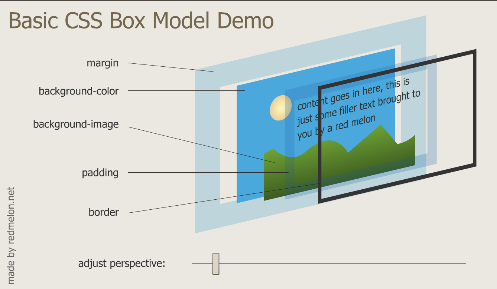

color tool

- colorhunt.co
- https://developer.mozilla.org/en-US/docs/Web/CSS/color_value

# CSS default value

# border style

# pesticide

- https://www.udemy.com/course/100-days-of-code/learn/lecture/21927602#overview

# <link rel="stylesheet" href="/css/styles.css> in index.html.

- with leading "/" it makes the link relative to the root

# <link rel="stylesheet" href="/=css/styles.css> in index.html.

- without leading "/" it makes the link relative to the sub-directory where index.html is existing.

CSS debugger

- use chrome developer tool cosole

# CSS priority

- inline style override the internal css file and external css file
- internal css file overrides external css file
- id priroity > class priority > tag priority
- html tag has default style applied by browser, which could be defined by user defined style

# class and id

- one html tag can **NOT** have more than one id
- but one html tag can have more than one class
- priority rule:
  - the more specific, the more prioritized it has

# Pseudo class :

```css
img:hover {
  background-color: gold;
}
```

# CSS Syntax

- selector {property: value;}
  who? what? how
- property:
  https://developer.mozilla.org/en-US/docs/Web/CSS/Reference

# CSS comment

/_ klsdkfjlsd _/

# link css file to html file

  <head>
  <link rel="stylesheet" type="text/css" href="theme.css">
  </head>

# favicons

- favorit icon
- favicon.cc : create a favicon
    <link rel="icon" href="images/sx_favicon.ico" />

# CSS box model



# Common Block Elements

- <p>
- <h1> to <h6>
- <div>
- <ol> <ul> <li>
- <form>

# display

- block
  - block elements have width.
  - width is the whole line and not defined by content
  - height is defined by content
- inline
  - inline elements do not have width
  - width is defined by content inside tag
  - height is defined by content
- inline-block
  - inline-block have width.
  - width can be defined
  -
- none

```css
  display: none  /* no display no space */
  visibility: none  /* no display but with space */
```

# Even without CSS, HTML tag has predefined property to display in browser

# We have to understanding the default positioning before we change the position

# position sitting ruls

1. Content is everything
2. Order comes from code
3. Children element is sitting on top of the parent element

# postion

- static
  - by default
  - going along with HTML rules and keep HTML default float
- relative
  - relative to the position where used to be
  - relative property doesn't affect any other element float
  ```css
  position: relative;
  left: 200px;
  /* move the block to left relative to the position where used to be*/
  ```
- absolute

  - move the positon relative to its parent element postion
  - absolute property does affect other element float
  - in order to set an element to be float, it's parent element must be relative, Otherwise it would relative to <body>

  ```css

  ```

  - https://www.udemy.com/course/100-days-of-code/learn/lecture/21927738#overview

- fixed

  - fixed to the top
  - it stays at its posistion when scrolling the browser
  - useful for nav bar or side bar.

- center element

  - text-align: center
    - text-align makes the element center inside the container that text-align is in.
    - But text align ment doesn't work for the sub element that has width property specified.
  - margin: 0 auto;
    - center the element that has width property specified

- Font

  - most used font
    - serif (default)
    - sans-serif
    - monospace
      - every letter has the same space. usually for coding

  ```css
  body {
    font-family: verdana, sans-serif; /* first it set verdana, if not available in that browser, it then set sans-serif */
  }
  ```

  - CSS font stack https://www.cssfontstack.com/

  # embed font

  - https://fonts.google.com/

  ```html
  <!-- copy the link to the <head> section -->
  <link
    href="https://fonts.googleapis.com/css2?family=Open+Sans:wght@300&family=Roboto:wght@100&display=swap"
    rel="stylesheet"
  />
  ```

  # lorem

  - lorem25

  # image resources:

  - https://www.flaticon.com/
  - gif: https://giphy.com/
  - Free images: https://unsplash.com/

  # size

  - font-size:
    100% is 16px
    if we want 90px size, we can set 562.5% = 90/16
    font-size: 562.5%
    - in this setting the font size would scale with browser font size setting.
    - font-size: 90px;
      - in this setting, the font size would **NOT** scale with browser font size setting.
    - dynamic font size:
      - use em
        **1em = 16px = 100%**
      - 1em 100%: dynamic font size
        - **based on parent elemtn font-size.**
          - 2em: add 2 times to its parent elemnt font-size.
          - the same rule for %
        - rem: refer to the root em in CSS3, regardless to parent element font size
          - recommended to use rem.
      - 16px: static font size

  # float and clear

  - float: left;
  - clear: left;
  - **use float only for wraping text, not for positioning.**

  # Button Creator

  - https://cssbuttoncreator.com/
  - https://css3buttongenerator.com/

  # CSS Combinators

  - https://www.w3schools.com/css/css_combinators.asp

  ```css
  <!-- Descendant Selector including sons,
  grandsons ... -- > div p {
    background-color: yellow;
  }

  <!-- Child Selector (>) only including sons.-- > div > p {
    background-color: yellow;
  }
  ```

  # HTML CSS practice

  https://www.frontendmentor.io/
