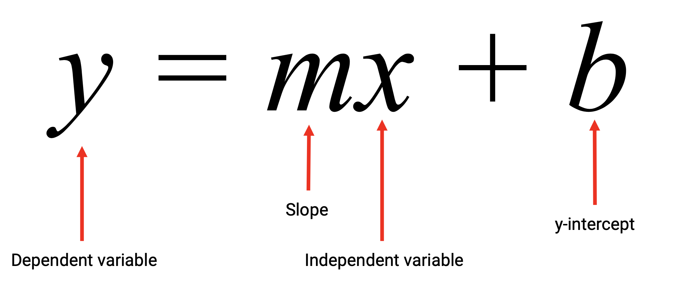

## Matplotlib

- A Python Library that Visualizes a Dataset
- Types of datasets include:
  - Pandas DataFrames
  - Lists, tuples, and dictionaries
  - NumPy arrays
- Types of visualizations include:

  - Bar charts
  - Pie charts
  - Line charts
  - Scatter plots

- General plotting process using pyplot

1. Create your dataset.

   - Data can be generated from functions, pulled from Pandas DataFrames, etc

2. Generate your plot.

   - Use the **pyplot.plot()** function to tell Matplotlib what data to use and which plot to make

3. Customize your plot

   - Change the axis,
   - label the figures,
   - color the data points
   - make the plot as informative to the reader as possible.

- Steps to improve readability of plots

1. Add labels to x and y axis

   ```py
     plt.xlabel()
     plt.ylabel()
   ```

2. Add title to plots

   ```py
     plt.title()
   ```

3. Limit the boundaries oa the x and y axes

   ```py
     plt.xlim()
     plt.ylim()
   ```

❓❓❓ why here is axes slides 24

- Adding labels makes graphics easier to understand and prevents them from being inadvertently misleading.
  - Limiting the range of the plot maximizes the data-to-ink ratio:
  - “Ink” used to make data/Total “ink” of the plot
  - It’s best to use the least amount of ink to show the most amount of data

❓❓❓ low data-to-ink ratio slide 26

## It's very important to choose the right plot for a given dataset

- Bar Charts
  - Useful for comparing different entities to one another
  - Bar charts help to visualize **UniVariate data**
    - Univariate data refers to data with one variable, or one type of measurement.
    - eg.
      - Amount of rainfall, in inches
      - Number of votes in a poll
      - Number of people per category
    - Bar charts are particularly useful when a single variable is being counted multiple times.
  - Bar charts are NOT effective for visualizing bivariate data
    - Bivariate data refers to data with two variables.
      -Anything you can plot as a line or scatter plot is bivariate data.
      - Example: A dataset comparing the number of ice cream bars sold versus daily temperature.
- Pie Charts

  - Useful for demonstrating different elements of a complete dataset
  - Pie Charts Help Visualize Simple Categorical Data
    - Pie charts are great for visualizing data that is percentages, or proportions.
    - Examples:
      - Proportion of Democrat versus Republican versus independent voters
      - Percentage of children’s favorite story characters
      - Distribution of left-handed versus right- handed pitchers in baseball
    - Fewer categories increase the effectiveness of a pie chart.
  - Pie charts are NOT effective for large or multivariate data
    - With more than ~10 categories, pie charts become too crowded and lose effectiveness.
    - Like bar charts, pie charts are only effective for visualizing univariate data.
    - When in doubt, just use a bar chart.

- Scatter Plots

  - Useful for displaying where values fall in respect to two factors
  - Powerful visualizations for bivariate data
    - Bivariate data refers fo data with two variables
      - Each data point is a combination of two variables
      - Anything plotted on an x- and y-axis is bivariate data.
      - Example: The amount of ice cream sold per daily temperature
    - Scatter plots are helpful for visualizing large datasets (i.e., thousands of data points).
    - Scatter plots are frequently used to visualize clustering in a dataset.
  - Scatter plots are NOT effective for continuous measurements.

    - When data is continuous, we’ll often want to interpolate between measurements.
      - The most common continuous data is time series.
    - Scatter plots visualize “scattered” data, so interpolation is almost impossible.
    - Line plots allow the audience to read between the data points.

  - np.arange(start, end, step)

  - the [Matplotlib documentation](https://matplotlib.org/2.0.2/index.html) to see what additional formatting could be added to the chart.

## Difference between "axes" and "axis" in matplolib

- Axis is the axis of the plot, the thing that gets ticks and tick labels. The axes is the area your plot appears in.
- https://stackoverflow.com/questions/5575451/difference-between-axes-and-axis-in-matplotlib
- This figure from the documentation will answer your question:
- 

  - Figure:
    - The whole figure (marked as the outer red box).
    - The figure keeps track of all the child Axes,
    - The canvas
    - A figure can have any number of Axes, but to be useful should have at least one.
    ```py
      fig = plt.figure()  # an empty figure with no axes
      fig, ax_lst = plt.subplots(2, 2)  # a figure with a 2x2 grid of Axes
    ```
  - Axes:

    - This is what you think of as ‘a plot’.
    - it is the region of the image with the data space (marked as the inner blue box).
    - A given figure can contain many Axes, but a given Axes object can only be in one Figure.
    - The Axes contains two (or three in the case of 3D) Axis objects
      - Axis is the object which take care of the data limits
      - the data limits can also be controlled via set via the set_xlim() and set_ylim() Axes methods

  - Axis / plot

    - These are the number-line-like objects (circled in green).
    - it is the region of the image with the data space
    - They take care of setting the graph limits
    - generating the ticks (the marks on the axis)
    - generating ticklabels (strings labeling the ticks).

  - Artist

    - Basically everything you can see on the figure is an artist (even the Figure, Axes, and Axis objects).
    - This includes Text objects, Line2D objects, collection objects, Patch objects
    - all of the artists are drawn to the canvas.
    - Most Artists are tied to an Axes;
      - such an Artist cannot be shared by multiple Axes, or moved from one to another.

  - Matplotlib gallery https://matplotlib.org/2.0.2/gallery.html

  - Matplotlib examples https://matplotlib.org/2.0.2/examples/index.html

  - Work with messy data
    1. Rename headers
    2. Remove missing data
    3. Convert and clean up column data
    4. In most cases, we will work with real- world data in Pandas.

## groupby

- Returns a DataFrame from a GroupBy Object
  df.grouby('state').mean()
- Returns a Series from a GroupBy Object
  df.groupby('state')['city'].mean()

## Three most common measures are mean, median, and mode.

### Mean

- Mean is the sum of all values divided by the number of elements in a dataset
- Mean is calculated using NumPy.

### Median

- Median is the middle value in a sorted dataset.
- Median is calculated using NumPy.

### Mode

- Mode is the most frequently occuring value(s) in a dataset.
- Mode is calculated using SciPy.

## When new data comes along, you must plot it!

1. To determine if the data is normally distributed
2. To determine if the data is multimodal
3. To characterize clusters in the dataset.

## What Is Normally Distributed Data?

1. The distribution of data follows a bell curve shape.
2. We can quantitatively test if a dataset is normal using SciPy.

   - stats.normaltest()

3. Some statistical tests assume normally distributed data.

## Variance and Standard deviation

- Variance is the measurement of how far each value is away from the mean of the dataset
- Standard deviation is the square root of variance.
- In Python, both variance and standard deviation are calculated using the NumPy module.

## Quantiles, Quartiles, and Outliers Describe a Dataset

1. Quantiles divide data into well-defined regions based on a sorted dataset.
2. Quartiles are a specific type of quantile where a sorted dataset is split into four equal parts.

- Q1: 25% of the data
- Q2: 50% of the data
- Q3: 75% of the data ❓❓❓

3. Outliers are an extreme value in a dataset that can skew calculations and results.
   ❓❓❓ 5.3 slide 17
   what is Quantiles vs Quartiles

## How to Identify Potential Outliers

1. Qualitatively

- Use box and whisker plots to visually identify potential outlier data points.
  - Use Matplotlib’s pyplot.boxplot function to plot the box and whisker.
  - 

2. Quantitatively

- Determine the outlier boundaries in a dataset using the “1.5 IQR” rule.
  - IQR is the interquartile range, or the range between the 1st and 3rd quartiles.
  - Anything below Q1 – 1.5 IQR could be an outlier.
  - Anything above Q3 + 1.5 IQR could be an outlier.
- Use Pandas’ series.quantile function to calculate the quantile.
- Calculate the outlier boundaries

## Correlation

- Correlation describes the question,“Is there a relationship between A and B?”
- Positive Correlation
  - 
- Negative Correlation
  - 
- No Correlation
  - 

### Pearson’s Correlation Coefficient

- In statistics, we quantify correlation using Pearson’s r.
- Pearson’s correlation coefficient describes the variability between two factors, denoted by the variable r.
- Pearson’sr is –1 ≤ r ≤ 1
  - –1 indicates perfect negative correlation.
  - 1 indicates perfect positive correlation.
  - 0 indicates no correlation.
- Real-world data is never perfect.

| abr(r)             | Correlation  |
| ------------------ | ------------ |
| abs(r) < 0.3       | none or weak |
| 0.3 < abs(r) < 0.5 | weak         |
| 0.5 < abs(r) < 0.7 | moderate     |
| 0.7 < abs(r)       | strong       |

### The equation of a line

- y = mx + b

  - 

- Linear Regression Fits the Equation of a Line to Real-World Data
  - Predicts the values of factor B, given values from factor A.
  - Estimates where data points that were not measured might end up if more data was collected.
  - Is used to predict housing prices, stock market, weather, etc.

### What is a Z-Score

- Simply a z-score (also called a standard score) gives you an idea of how far from the mean a data point is.
- more technically it’s a measure of how many standard deviations below or above the population mean a raw score is.
- https://www.statisticshowto.com/probability-and-statistics/z-score/

## Add grid
plt.grid(True)
## Save the figure
plt.savefig("filepath")

# color map
https://matplotlib.org/examples/color/colormaps_reference.html

# Add more y axis 
https://www.delftstack.com/howto/matplotlib/how-to-add-y-axis-label-to-secondary-y-axis-in-matplotlib/
https://stackoverflow.com/questions/11640243/pandas-plot-multiple-y-axes

