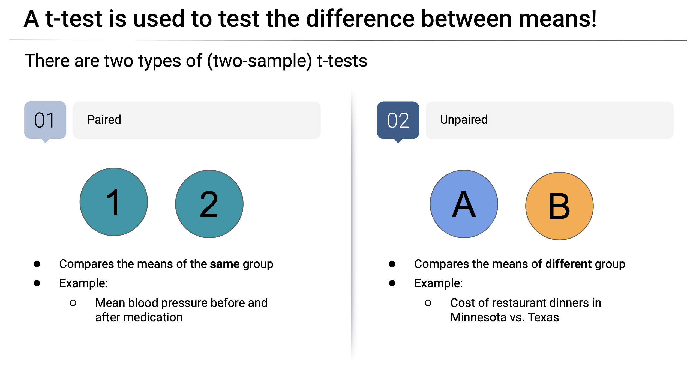

# T-test

- A t-test is used to test the difference between means
- There are two types of (Two sample) t-tests
  - Paired
    - Compares the means of the same group
    - Example
      - Mean blood pressure before and after medification
  - Unpaired
    - Compares the means of different group
    - Example:
      - Cost of restaurant dinners in Minnesota vs. Texas

